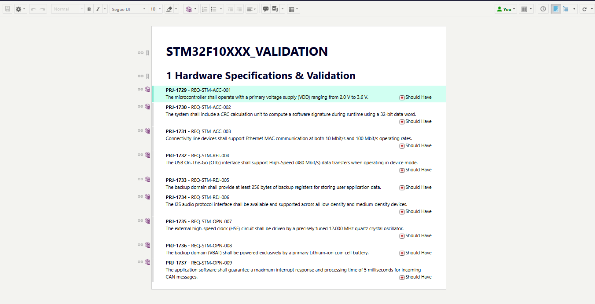
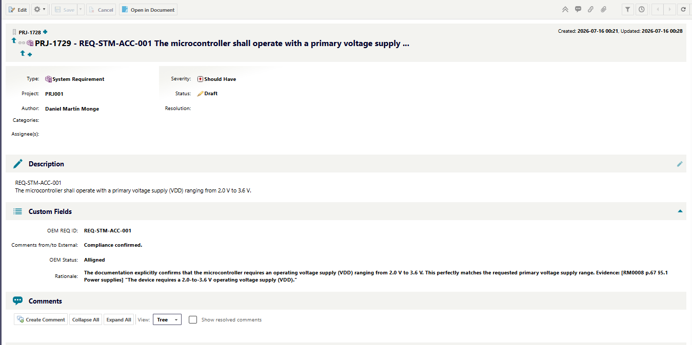
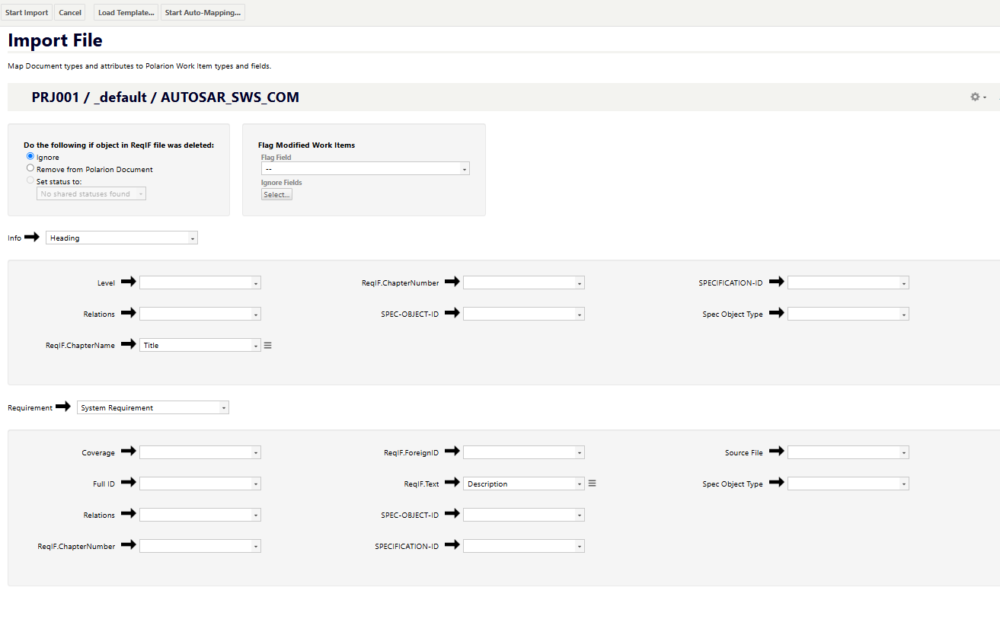

# CTSM · Customer-to-Supplier Mapping

*Read this in [Español](README.es.md).*

Audits the requirements of a customer specification (a ReqIF exported from Polarion) against the supplier's documentation (PDF), and returns **the same ReqIF file** with, for every requirement, the evidence found and its exact page. The model never writes a location. The input file is never regenerated. It runs without a network.

> AI carries risk. Code bounds it. The standard answers for what remains.

[Design philosophy](#design-philosophy) · [Why AI here](#why-ai-here) · [The five steps](#the-five-steps-in-this-project) · [Measured](#measured) · [Demo](#demo-in-five-commands-public-data) · [Limitations](#limitations) · [Security & regulation](#security--regulation)

---

## Design philosophy

Every AI application has five steps. Only step 4 invokes a model; the other four are code: reproducible, testable, offline. Step 5 never patches: it flags and degrades. Full text at [epifaneia.dev](https://epifaneia.dev).

```
 1 CLEANING      2 CONTEXT       3 INPUT GUARDRAIL   4 PROCESS        5 OUTPUT GUARDRAIL
 ■ code          ■ code          ■ code              ▲ model          ■ code
```

## Why AI here

A customer specification has dozens of requirements; the supplier manual that answers them has a thousand pages. Matching one against the other is reading and judgment, and a conventional tool drowns in it: keyword search over a Polarion export of thousands of XML lines and a 1,136-page manual returns noise, and a human doing it by hand takes days per document. The model does the one thing only a model can do, read a requirement and find the passage that answers it, and code does everything else: where the passage is, whether the quote is real, and that the file the customer gets back is the one it sent.

---

## The five steps in this project

★ marks where the improvement lives in this project: **context** and the **output guardrail**.

| Step | What it does here | |
|---|---|---|
| 1 · Cleaning | `s0` adds the three target fields to the ReqIF if the export lacks them (schema only, deterministic ids). `s1` parses ids, hierarchy, target fields and the status enum of the file itself. `s2` turns the supplier PDFs into chunks with section, page and a per-offset `page_map` (PyMuPDF; encrypted PDFs decrypted in memory). | |
| 2 · Context | `s3` retrieves BM25 top-K chunks per requirement, or passes the whole corpus through when it fits. Every chunk carries an id, a page and a section: the model will be able to point, never to describe. `utils/citables` splits each chunk into numbered units so a quote can be chosen by index. | ★ |
| 3 · Input guardrail | `s4` calls with a forced response schema: `status` restricted to the enum the file declares, `chunk_id` restricted, per requirement, to the candidates of that requirement. Citing a location that was not given is structurally impossible. | |
| 4 · Process | One call per requirement, no batches. Backend `ollama` (local, default) or `gemini` (cloud), same contract. In v2 mode there is no call at all: `s4_evidence` locates and trims the literal passages, and `s5_review` asks a small model, per passage, "supports, contradicts, irrelevant?". | |
| 5 · Output guardrail | `s6` checks every quote verbatim against the cited chunk (rapidfuzz ≥ 0.85), derives the exact page from the match offset, and degrades any verdict left without verified evidence to the open value, with a flag. In v2, one contradicting passage is enough for a "no". `s7` edits the original with lxml and `roundtrip_diff` proves nothing else changed: three locks, five sabotages, five caught. | ★ |

### What it writes, and where

| Field in the customer ReqIF | What gets written |
|---|---|
| `Status` (enumeration) | The verdict, by `ENUM-VALUE-REF` to a value the file already declares. Never free text. |
| `Rationale` (XHTML) | The analysis plus anchored citations: `[RM0008 p.81 §6.1] "quote..."`. |
| `Comments from/to External` (XHTML) | A short message back to the customer: confirmation, deviation request, or question. |

## Measured

Set: 9 requirements written against the STM32F10xxx reference manual RM0008 (1,136 pages, public document from ST), with ground truth built by hand. Machine: RTX 2060 6 GB, Ryzen 5 3500X.

| Engine | Hits vs ground truth | False "compliant" | Seconds / requirement |
|---|---|---|---|
| gemini (cloud) | 9 / 9 | 0 | — |
| **qwen2.5:14b, local** | **8 / 9** | **0** | 122 → 77 after calibration |
| qwen2.5:7b, local | 7 / 9 | 0 | 25 |

Three things follow from that table, in order. The local model removes the data leaving the machine. The bounded task is what makes a 14B enough. And what the 14B misses, the guardrail flags instead of letting through: one of nine went to *Unconfirmed*, none to a false *Compliant*.

`tools/score_vs_fixture.py` reproduces the table. Calibrate Ollama threads with the **longest** prompt of the set, not the shortest: a sweep on the short prompt suggested forcing 32 GPU layers for an apparent +59 %; on the long prompt that same setting was worse than Ollama's autofit.

Beyond the public set, the pipeline has been run on a real customer specification (53 requirements) and its supplier manuals. That data is not in this repository; the screenshots below are from the public set.

## Polarion

Public data in a Polarion trial: the nine STM32 requirements against RM0008. Nothing to redact.

*The demo document after import: one heading, nine requirements, each with its verbatim identifier as title.*



*The same requirement after the pipeline wrote back into the file: the status enum set, the rationale with the citation, and the page and section derived by code from the supplier manual.*



*The ReqIF import mapping in Polarion: the pipeline's fields map onto the project's own fields; nothing is created on the Polarion side.*



## Demo in five commands (public data)

```bash
pip install -r requirements.txt
ollama serve && ollama pull qwen2.5:7b            # local by default; nothing leaves the machine

# 1. a starting ReqIF from the fixture, cloning the schema of any ReqIF exported from your Polarion
CTSM_STK_TEMPLATE=path/to/any_export.reqif python tools/build_demo_stk.py
# 2. drop RM0008 (st.com, reference manual STM32F10xxx) in data/inputs/supplier_docs/
python pipeline/s2_supplier_corpus.py             # PDF → corpus (1.9 s for 1,136 pages)
python run.py STM32                               # s1 → s7 on the demo file
python tools/roundtrip_diff.py data/inputs/stk_reqif/STM32F10xxx_Validation.reqif data/outputs/reqif/STM32F10xxx_Validation.reqif
```

This repository ships no data: no inputs, no intermediates, no outputs. `data/` is ignored by git.

## Limitations

- The demo needs a ReqIF exported from *your* Polarion as schema template. Exports differ by project, so `build_demo_stk` clones yours by `LONG-NAME` instead of shipping one.
- `s5_config` (extraction of configuration parameters) is a stub taken out of scope.
- The scoring that `s6` promises in its docstring never runs on real files. Use `tools/score_vs_fixture.py`.
- The import into Polarion of a pipeline-written file was verified structurally (roundtrip_diff) and visually (screenshots); the import itself is a manual step.
- Docling is reserved for scanned documents and is not wired by default: it downloads models on first run, which would break the air gap of `s2`.
- Identity, events and sign-off are shipped as a contract with a local default (environment variable, JSONL file, HMAC key). The adapters to a company's Entra ID, SIEM or PKI are not here and cannot be tested here: see [docs/INTEGRATION.md](docs/INTEGRATION.md).

---

## Security & regulation

Same four headings in every repository. Rows marked **today** are what the code does. Rows marked **wire** are the three integration wires the repository ships as a contract (identity, events, sign-off) and the company connects to its own systems: see [docs/INTEGRATION.md](docs/INTEGRATION.md). Local tests: `python tests/test_custodia.py`.

| | | |
|---|---|---|
| **Confidentiality** | Local by default: Ollama on `127.0.0.1`, a 14B model, no byte leaves the machine, the whole pipeline runs with the network unplugged. The task is bounded enough for that model to be enough (8/9, 0 false "compliant"). The cloud backend is for non-confidential data and comparison only: when on, `s4` prints on every run that it sends the requirement text and up to 10 chunks of the supplier manual (~28,000 characters) to Google. Encrypted PDFs are decrypted in memory; no cleartext copy is written. `data/` and `.env` are outside git. | **today** |
| **Traceability** | Every verdict carries its evidence with document, page, section and match ratio; the citation is composed by code, never by the model. `logs/` keeps per-run traces with chunk ids, scores and flags, never the requirement text or the prompt. | **today** |
| | **Wire 2 · events.** Every model call goes through `custodia/ledger`: one JSON line with actor, step, engine, endpoint, whether data left the machine, input size and hash. Never the text. `logs/custody.jsonl` or stdout. The company points its SIEM at it. | **wire** |
| **Leak prevention** | The model holds no credentials; the step that invokes it holds the endpoint and sees only the chunks selected for that requirement. Everything else is code with no network access. | **today** |
| | **Wire 1 · identity.** `run.py` refuses to start without a named actor (`custodia/identity`, default `CUSTODIA_ACTOR`); the actor is stamped on every event and every signature. The company replaces the provider with Entra ID, LDAP, Kerberos or its SSO in one call. Per-layer permissions on inputs, intermediates, model and outputs are the company's, on its file system and its vault. | **wire** |
| **Human in the loop** | Any requirement without verified evidence stays at the open value with a flag; the reviewer looks at what is flagged, not at everything. In v2 mode the system never rules: it locates evidence and the engineer decides. | **today** |
| | **Wire 3 · sign-off.** An output is a proposal until `tools/signoff.py sign` writes its manifest (file hash, actor, timestamp, signature) and `verify` passes; a changed file or a wrong key fails. Nothing the model touched is imported or sent without a manifest that verifies. The company replaces the local HMAC key with its PKI or its Polarion approval workflow by registering two functions. | **wire** |

Framework: EU AI Act (2024/1689) · GDPR · ISO/IEC 42001 · ISO/IEC 27001 · TISAX.

---

## Structure

```
pipeline/    s0..s7 (s5_config retired)      docs/       PLAN.md · RISK_roundtrip.md · INTEGRATION.md · pipeline_arquitectura.html
clients/     ollama (local, default) · gemini (cloud) · docling_adapter
prompts/     evaluar_status.txt (taxonomy injected at runtime)
tools/       roundtrip_diff · reqif_lint · score_vs_fixture · build_demo_stk · build_report · signoff
utils/       citables · text_norm · json_helpers
custodia/    identity · ledger · signoff · cli  — the three integration wires
data/        inputs · interim · outputs — all outside git
```

Daniel Martín · [epifaneia.dev](https://epifaneia.dev) · Apache-2.0
